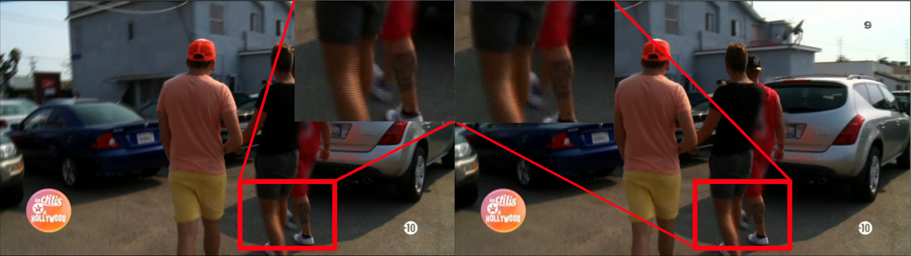

# Image Deinterlace Tool

A high-performance C++ tool for deinterlacing interlaced images using multiple processing modes including CPU, GPU, and multi-threaded approaches.

## Features

- **Multiple Processing Modes**: CPU, GPU (OpenGL), async, and multi-threaded deinterlacing
- **FFmpeg Integration**: Built on FFmpeg for robust image format support
- **Linux Support**: Optimized for Linux systems
- **High Performance**: GPU acceleration with OpenGL compute shaders
- **Pipeline Architecture**: Modular design for easy extension

## Quick Start

### Prerequisites

- **Linux**: GCC 7+ or Clang 8+
- **FFmpeg**: Built from source (included in external/ffmpeg/)
- **OpenGL**: 4.3+ for GPU mode (optional)

### Building

```bash
# Linux
./build_linux.sh
```

**Note**: The build script will automatically compile FFmpeg from source in the `external/ffmpeg/` directory.

### Docker Support

A `Dockerfile` is provided for easy building and running of the project in a containerized environment. This is useful if you want to avoid installing dependencies directly on your system.

### Build and Run with Docker

```bash
# Build the Docker image
sudo docker build -t img-deinterlace .

# Start a container and open a shell
sudo docker run -it --rm img-deinterlace

# Inside the container, you can run:
./bin/Debug-linux-x86_64/img_deinterlace/img_deinterlace --help
```

You can also mount a local directory to the container to process your own images:

```bash
sudo docker run -it --rm -v /path/to/images:/data img-deinterlace \
  ./bin/Debug-linux-x86_64/img_deinterlace/img_deinterlace --input /data/in.jpg --output /data/out.jpg
```

### Usage

```bash
# Basic usage
img_deinterlace --input interlaced.jpg --output deinterlaced.jpg

# GPU acceleration
img_deinterlace -i interlaced.jpg -o deinterlaced.jpg --mode gpu

# Multi-threaded processing
img_deinterlace -i interlaced.jpg -o deinterlaced.jpg --mode threads
```

## Example Result

Below is an example image showing the effect of deinterlacing. The image is wide, with the original (interlaced) version on the left and the deinterlaced result on the right:



## Processing Modes

| Mode | Description | Performance | Requirements |
|------|-------------|-------------|--------------|
| `default` | CPU-based blending | Medium | Any CPU |
| `async` | Asynchronous processing | High | Multi-core CPU |
| `threads` | Multi-threaded processing | High | Multi-core CPU |
| `gpu` | GPU acceleration | Very High | OpenGL 4.3+ |

## Command Line Options

```
--input, -i     Input image file (required)
--output, -o    Output image file (default: output.jpeg)
--mode, -m      Processing mode: default, async, threads, gpu
--help, -h      Show help message
```

## Supported Formats

- **Input**: JPEG, PNG, BMP, TIFF (via FFmpeg)
- **Output**: JPEG, PNG, BMP, TIFF (via FFmpeg)

## Architecture

The tool uses a pipeline architecture with three main components:

1. **Decoder** (`FFmpegDecNode`): Reads and decodes input images using FFmpeg
2. **Processor** (`Deinterlace*ProcNode`): Applies deinterlacing algorithms
3. **Encoder** (`FFmpegEncNode`): Encodes and writes output images using FFmpeg

### Dependencies

- **FFmpeg**: Built from source for maximum compatibility and control
- **GLFW**: Window management and OpenGL context creation
- **GLAD**: OpenGL loading library

## Algorithm

The deinterlacing algorithm blends odd and even scan lines:
- Even lines (0, 2, 4...) remain unchanged
- Odd lines (1, 3, 5...) are blended with the previous line: `new = (current + previous) / 2`

## Development

### Project Structure
```
src/
├── main.cpp                 # Entry point
├── parser/                  # Command line parsing
├── nodes/                   # Pipeline components
│   ├── base/               # Base classes
│   ├── FFmpegDecNode       # Image decoder
│   ├── FFmpegEncNode       # Image encoder
│   └── Deinterlace*ProcNode # Processing nodes
```

### Adding New Processing Modes

1. Inherit from `Processor` class
2. Implement `updatePacket()` method
3. Add mode to `main.cpp` pipeline selection

## Troubleshooting

### GPU Mode Issues
- Ensure OpenGL 4.3+ is available
- Check GPU drivers are up to date
- Verify compute shader support

### Build Issues
- Ensure all dependencies are properly linked
- Check FFmpeg libraries are in the correct location
- Verify compiler supports C++17

## License

This project is licensed under the MIT License - see the [LICENSE](LICENSE) file for details.

## Acknowledgments

- FFmpeg for media processing capabilities
- GLFW for OpenGL context management
- GLAD for OpenGL loading
